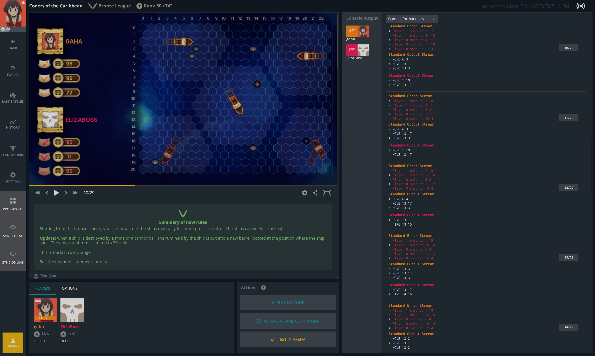
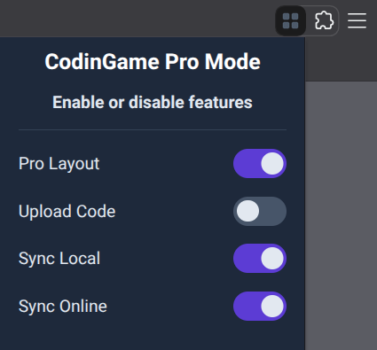

# CodinGame Pro Mode

> [Install from Chrome Web Store](https://chromewebstore.google.com/detail/fleeplnobejocpmlphmbhlnhnimoglpa)
>
> Firefox is not currently supported.

Do you prefer coding in your own local editor? This extension optimizes the CodinGame UI for you. It introduces **Pro Layout**, which hides the online editor to reclaim screen space and provides an expanded console for a better view of your logs and messages.

It also features seamless two-way code synchronization:

- **Sync Local**: Automatically reflects changes from your local file in the online editor.
- **Sync Online**: Instantly saves code from the online editor back to your local file.

## Pro Layout

Clicking the **Pro Layout** button has the following effects:

* Hides the code editor
* Moves the 'Console output' to the right
* Moves 'Players' and 'Actions' to the left, under the game visualization

This is a toggle button. Click it again to restore the default layout.

*Screenshot showing how 'Pro Layout' looks in practice.*

## Code Synchronization

This extension offers code synchronization functionality. No external apps are necessary. You can choose to use a one-way sync or a two-way sync. Just click one of the buttons and select a local file that will be synchronized.

### Browser support

* **Edge**: works out of the box
* **Chrome**: works out of the box
* **Brave**: works if API is enabled

Synchronization requires the File System Access API. If this API is disabled or not supported, the sync buttons will be grayed out, but the 'Pro Layout' feature will still work perfectly. To manually enable the API, go to: `chrome://flags/#file-system-access-api`.

## Popup menu

You can enable or disable features from the Popup menu. Refresh CodinGame website after making changes.

## Troubleshooting

> Synchronization feature does not work

This means the extension cannot access the local file system because File System Access API is not available.

* If you are using a Chromium-based browser like Brave, you may need to manually enable the API by navigating to `chrome://flags/#file-system-access-api` and enabling the flag.
* If you are using Firefox, most likely you won't be able to use the synchronization feature.

If you cannot fix this problem, you can disable the feature entirely using the Popup menu. Consider enabling 'Upload Code' instead for a simpler, one-time code synchronization.

> Add support for Firefox

Firefox does not currently support the necessary subset of File System Access API. Technically, you can still install CodinGame Pro Mode and use it without the synchronization functionality. To do that, download the extension source code to your computer and [install it locally in Firefox](https://extensionworkshop.com/documentation/develop/temporary-installation-in-firefox).
