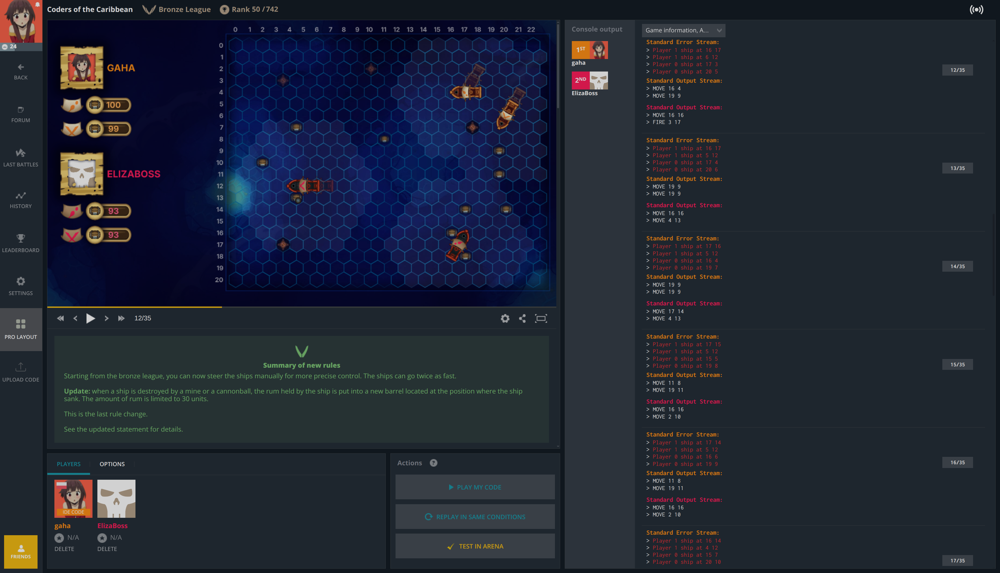

# CodinGame Pro Layout
[Download from Chrome Web Store](https://chromewebstore.google.com/detail/fleeplnobejocpmlphmbhlnhnimoglpa)

Reclaim your precious screen real estate in CodinGame IDE:
* Hide the code editor
* Move the 'Console output' to the right
* Add 'Upload Code' button
* Add 'Pro Layout' toggle button to enable/disable the modified layout

---

---

Best used with `cg-local`:
* https://github.com/jmerle/cg-local-ext
* https://github.com/jmerle/cg-local-app
